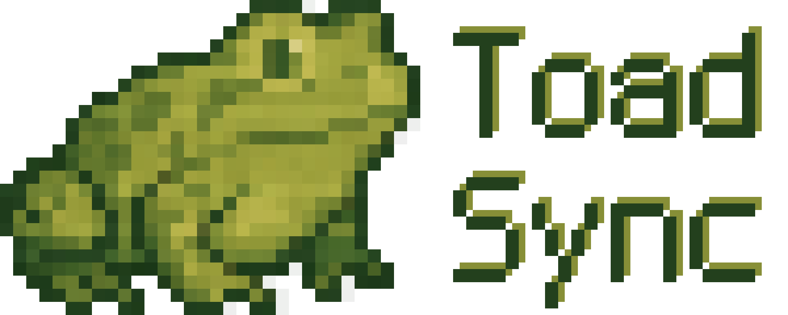

# ToadSync



ToadSync is focusing on four things:

* Title (window title)
* Options (options.txt)
* Assets (resource pack)
* Data (datapack)

[](https://github.com/teaconmc/ToadSync/actions/workflows/build.yml)
[](https://github.com/teaconmc/ToadSync/releases/latest)

## Offline Usage

Just create a `config/toad-sync/` folder and put these four files into it:

| Type    | Filename               | Content                                                           |
|---------|------------------------|-------------------------------------------------------------------|
| Title   | `title.override.toml`  | Title manifest (explained below)                                  |
| Options | `options.override.txt` | Same as vanilla `options.txt`, but you can only keep useful lines |
| Assets  | `assets.override.zip`  | Resource pack (only single zip file supported)                    |
| Data    | `data.override.zip`    | Datapack (only single zip file supported)                         |

The format of `title.override.toml` is shown below:

```toml
# This title will be used if none of the game language can be matched by any of the entries below
title = "Fallback Title"

# This title will be used as the game window title for English game clients
[lang.en_us]
title = "English Title"

# This title will be used as the game window title for Simplified Chinese game clients
[lang.zh_cn]
title = "中文标题"
```

## Online Usage Without Updates

Create a `toad-sync-common.toml` inside `config/` folder:

```toml
# Title manifest
[sync.title]
hash = "e3b0c44298fc1c149afbf4c8996fb92427ae41e4649b934ca495991b7852b855"
file = "https://example.com/toad-sync/title.override.toml"

# Options
[sync.options]
hash = "e3b0c44298fc1c149afbf4c8996fb92427ae41e4649b934ca495991b7852b855"
file = "https://example.com/toad-sync/options.override.txt"

# Resource pack
[sync.assets]
hash = "e3b0c44298fc1c149afbf4c8996fb92427ae41e4649b934ca495991b7852b855"
file = "https://example.com/toad-sync/assets.override.zip"

# Datapack
[sync.data]
hash = "e3b0c44298fc1c149afbf4c8996fb92427ae41e4649b934ca495991b7852b855"
file = "https://example.com/toad-sync/data.override.zip"
```

The game will download the four files (on client side, the title manifest and the resource pack will not be downloaded
on dedicated server side) from `example.com`, check the hashes (hash format should be sha256) and try to load them. An
additional restart may be required depending on the download speed.

## Online Usage & Updates

Put the `toad-sync-common.toml` at a corner of the internet and write two lines in the `toad-sync-common.toml` of your
game instance:

```toml
# Time unit: second(s)
interval = 2.5
# The game will try to retrieve from this url every 2.5 seconds
remote = "https://example.com/toad-sync-common.toml"
```

You can use relative paths in those `file` entries of `toad-sync-common.toml` on the remote side for file referencing,
whose base url is defined by the `remote` entry of the `toad-sync-common.toml` of the game instance.

If any update found (different hashes of the old files and the new files), the new files will be downloaded, and after
hash checks, the game instance will try its best to hot-reload them (option updates require a restart). For a resource
pack, a notice will be popped-up, and the player should press `F3 + T` to make the new pack available.
